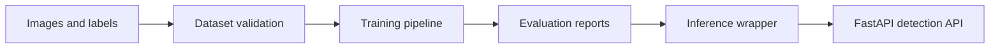

# Technical Review Pack

## System Boundary

This repository models an industrial weld-defect detection pipeline from data preparation through training, evaluation, inference, and API serving. The code supports synthetic data for pipeline verification when a real dataset is not present.

## Architecture Notes



The project separates dataset validation, model operations, and serving so each layer can be tested independently.

## Demo Path

```bash
python -m src.dataset --synthetic 50
pytest -q
uvicorn api.main:app --reload
```

Useful entry points:

- `src/dataset.py`
- `src/train.py`
- `src/evaluate.py`
- `src/inference.py`
- `api/main.py`

## Validation Evidence

- Tests cover dataset preparation, training configuration, and API behavior.
- `benchmarks/` includes accuracy and latency benchmarking entry points.
- `governance/` includes model-card and data-sheet documentation.

## Threat Model

| Risk | Control |
|---|---|
| Invalid label format | dataset validation tests |
| Unclear model behavior | model card and benchmark reports |
| Serving mismatch | API schema tests |
| Dataset provenance ambiguity | data-sheet documentation |

## Maintenance Notes

- Keep synthetic data generation deterministic.
- Record dataset assumptions before training changes.
- Separate performance claims from placeholder fixture results.
- Add API regression tests for every response schema change.
