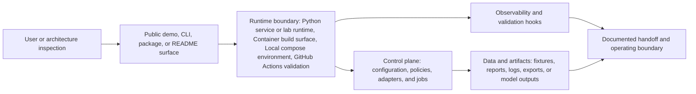

# System Architecture - weld-defect-vision

This document is the system-level architecture attachment for the repository. It keeps the technical stack, runtime boundary, data/control flow, deployment surface, and operating assumptions in one place.

## Architecture Summary

| Area | Design |
| --- | --- |
| Repository | `weld-defect-vision` |
| Primary domain | applied model pipelines and evidence-backed inference |
| Primary stack | Python service or lab runtime, Container build surface, Local compose environment, GitHub Actions validation |
| Architecture axes | cloud architecture, AI engineering, reliability, security, operator experience |

Repository-local proof surface for applied model pipelines and evidence-backed inference, backed by Python service or lab runtime, Container build surface, Local compose environment.

## Runtime And Data Flow



Primary domain: applied model pipelines and evidence-backed inference.

## Stack Surface

| Layer | Current surface | Operating note |
| --- | --- | --- |
| Interface | Public demo, README, CLI, package, or static proof surface depending on repository shape | Keep the first screen or command path inspectable without private credentials. |
| Runtime | Python service or lab runtime, Container build surface, Local compose environment, GitHub Actions validation | Keep runtime adapters bounded by environment configuration and documented fallbacks. |
| Control plane | Policies, configuration, job orchestration, tests, and release scripts | Keep operator-impacting changes traceable through docs and validation hooks. |
| Data and artifacts | Fixtures, generated reports, screenshots, exports, logs, or model outputs | Keep sample and generated artifacts clearly separated from private or customer data. |
| Operations | CI, local validation, architecture guard, and handoff notes | Keep the architecture docs current when runtime, data, or deployment boundaries change. |

## Cloud Or Local Deployment Boundary

Operating model: artifact registries, batch and online inference paths, edge/managed serving options, and model monitoring hooks

### Deployment patterns

- Containerized runtime path suitable for repeatable local, staging, or managed service deployment
- Model serving envelope with artifact traceability, inference monitoring, and quality drift hooks

### Control boundaries

- identity boundary and least-privilege service access
- environment separation for local, staging, and managed runtime paths
- secret storage outside source and deterministic fallback for missing credentials
- observability hooks for logs, metrics, traces, and audit events
- rollback path for deployment, schema, and model changes

### Resilience controls

- bounded retries with explicit failure states
- health/readiness checks before operator-facing flows are trusted
- idempotent data or artifact writes where repeat execution is possible
- cost and quota guardrails for hosted services and model adapters

## AI And Automation Boundary

Operating model: dataset checks, model evaluation, explainability artifacts, serving boundaries, and human-readable confidence evidence

### Engineering patterns

- Track dataset splits, model artifacts, inference outputs, and explainability evidence as first-class assets
- Pair quality metrics with failure modes, human architecture states, and rollback-ready serving boundaries
- Separate deterministic checks from model-generated output so the system remains testable without external credentials
- Capture prompts, inputs, outputs, and decision metadata as inspectable artifacts instead of hidden side effects
- Gate model-assisted actions with policy, confidence, and fallback states before they reach an operator path

### Evaluation and model-risk controls

- deterministic fixtures for CI-safe verification
- golden output or schema checks for generated artifacts
- trace capture for prompts, tool calls, inputs, and outputs
- quality gates that fail closed when evidence is missing

### Risks to keep explicit

- dataset leakage
- untracked model artifacts
- silent quality drift
- unsafe decision automation

## Attached Architecture References

- [Service architecture](service-architecture.md)
- [Cloud + AI architecture](cloud-ai-architecture.md)
- [Architecture manifest](architecture/blueprint.json)
- [Product operating model](product-operating-model.md)
- [Quality gate](quality-gate.md)

## Local Architecture Guard

```bash
python3 scripts/validate_architecture_blueprint.py
```

CI workflow: `.github/workflows/architecture-blueprint.yml`.

Update this document whenever runtime entrypoints, data stores, hosted services, model/provider boundaries, or operating assumptions change.

## Revenue Architecture Overlay

See [Revenue Architecture](./revenue-architecture.md) for the free-tier-first launch stack, productized offer, metering hooks, paywall boundary, and cost guardrails that turn this system architecture into a service path.
